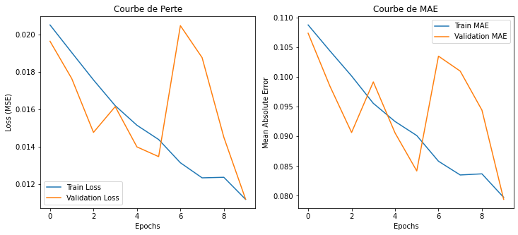
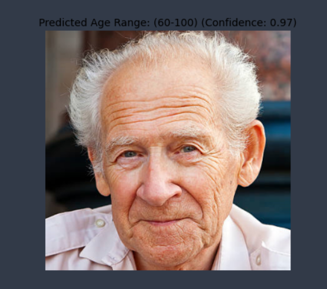

# 👶👴 Age Detection Using Deep Learning

## 📌 Project Overview
This project develops two approaches for **age detection** from facial images: **Part 1** uses a custom **CNN model** trained on the UTKFace dataset for regression-based age prediction, and **Part 2** leverages a pre-trained **Caffe model (age_net)** for age range classification. Both methods preprocess images and predict age, with results visualized and tested.

---

## 📂 Dataset
- **UTKFace Dataset**: Images labeled with age and gender, stored in `UTKFace/` directory.
  - Filename format: `[age]_[gender]_*.jpg` (e.g., `25_0_*.jpg` for 25-year-old male).
- **Input**: Grayscale images resized to 128x128 (Part 1) or RGB images at 227x227 (Part 2).
- **Output**: Continuous age (Part 1) or age range (Part 2, e.g., `(25-32)`).

---

## 🔍 Project Workflow

### **1. Part 1: Custom CNN for Age Regression**
Load, preprocess UTKFace images, and train a CNN model.

```python
import pandas as pd
import numpy as np
from tensorflow.keras.preprocessing.image import load_img
from PIL import Image
from pathlib import Path

# Load UTKFace dataset
path = Path("./UTKFace/")
filenames = list(map(lambda x: x.name, path.glob('*.jpg')))
np.random.shuffle(filenames)
df = pd.DataFrame({
    'image': filenames,
    'age': [int(f.split('_')[0]) / 100.0 for f in filenames],
    'gender': [int(f.split('_')[1]) for f in filenames]
})

# Preprocess images
def preprocess_images(image_files):
    images = []
    for file in image_files:
        img = load_img("UTKFace/"+file, color_mode="grayscale")
        img = img.resize((128, 128), Image.LANCZOS)
        img = np.array(img) / 255.0
        images.append(img)
    return np.array(images).reshape(len(images), 128, 128, 1)

# CNN Model
from tensorflow.keras.models import Sequential
from tensorflow.keras.layers import Conv2D, BatchNormalization, MaxPooling2D, Flatten, Dense, Dropout
model = Sequential([
    Conv2D(64, (3, 3), activation='relu', input_shape=(128, 128, 1)),
    BatchNormalization(),
    MaxPooling2D((3, 3)),
    Conv2D(128, (3, 3), activation='relu'),
    MaxPooling2D((2, 2)),
    Conv2D(256, (3, 3), activation='relu'),
    MaxPooling2D((2, 2)),
    Flatten(),
    Dense(256, activation='relu'),
    Dropout(0.5),
    Dense(1, activation='linear')
])
model.compile(optimizer='adam', loss='mse', metrics=['mae'])

# Train
from tensorflow.keras.callbacks import EarlyStopping
early_stopping = EarlyStopping(monitor='val_loss', patience=5, restore_best_weights=True)
history = model.fit(x_train, y_train, epochs=10, batch_size=32, validation_data=(x_val, y_val), callbacks=[early_stopping])
```

### **2. Part 2: Pre-trained Caffe Model for Age Range Classification**
Use `age_net.caffemodel` to classify age into predefined ranges.

```python
import cv2
import numpy as np

faceProto = "opencv_face_detector.pbtxt"
faceModel = "opencv_face_detector_uint8.pb"
ageProto = "age_deploy.prototxt"
ageModel = "age_net.caffemodel"
age_ranges = ['(0-2)', '(4-6)', '(8-12)', '(15-20)', '(25-32)', '(38-43)', '(48-53)', '(60-100)']

# Load models
faceNet = cv2.dnn.readNet(faceModel, faceProto)
ageNet = cv2.dnn.readNet(ageModel, ageProto)

# Process image
image = cv2.imread("photo2.png")
blob = cv2.dnn.blobFromImage(image, 1.0, (227, 227), (78.4263377603, 87.7689143744, 114.895847746), swapRB=False)
ageNet.setInput(blob)
age_preds = ageNet.forward()
predicted_age = age_ranges[age_preds[0].argmax()]
```

### **3. Testing**
Test the CNN model on a single image.

```python
def preprocess_image(image_path):
    img = load_img(image_path, color_mode="grayscale")
    img = img.resize((128, 128), Image.LANCZOS)
    img = np.array(img) / 255.0
    return img.reshape(1, 128, 128, 1)

model = tf.keras.models.load_model("model_age.keras")
image_test = preprocess_image("test.png")
predicted_age = round(model.predict(image_test)[0][0] * 100)
print(f"Âge prédit : {predicted_age} ans")
```

---

## 📊 Results
- **Part 1 (CNN)**:
  ```
  Epoch 10/10
  504/504 [==============================] - 378s 751ms/step - loss: 0.0112 - mae: 0.0797 - val_loss: 0.0112 - val_mae: 0.0794
  ```
  - **Visualization**: Loss and MAE curves: 
    
  
  - **Test Output**: Predicted age in years (e.g., "Âge prédit : 30 ans").
- **Part 2 (Caffe)**: Predicted age range (e.g., `(25-32)`) with confidence.
- **Capture**:

  

---

## 📦 Requirements
```bash
pip install pandas numpy tensorflow opencv-python pillow
```

---


## 📌 Key Insights
- **CNN Model** predicts continuous age with low MAE (~0.0794) on UTKFace dataset.
- **Caffe Model** provides robust age range classification for real-world applications.
- Preprocessing (grayscale, normalization) ensures consistent input for both models.
- Early stopping prevents overfitting during CNN training.

---

## 📜 License
MIT License
